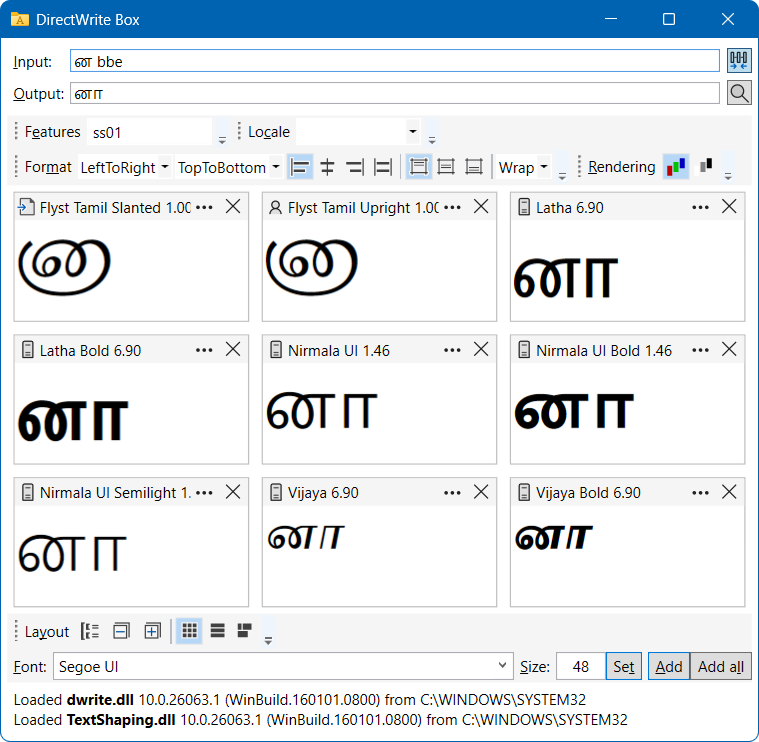
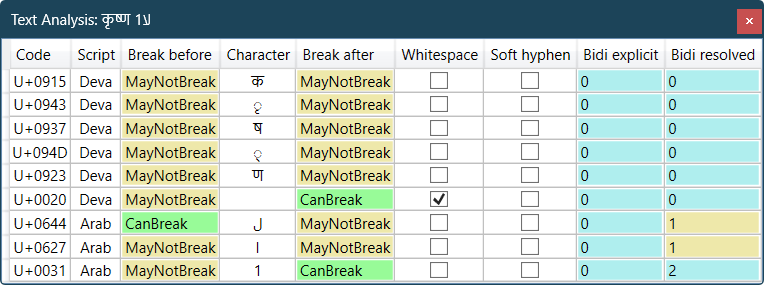
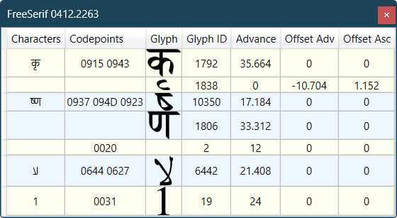

# DWBox

A tool for testing text shaping. 

Requires at least Windows 10 build 20348 (in practice that means Windows 11)

### Text Analysis

### GlyphRun Analysis

### Using private DirectWrite binary

For details, see [Dynamic-link library redirection](https://learn.microsoft.com/en-us/windows/win32/dlls/dynamic-link-library-redirection):

1. `reg add "HKLM\SOFTWARE\Microsoft\Windows NT\CurrentVersion\Image File Execution Options" /v DevOverrideEnable /t REG_DWORD /d 1`
2. Create an empty file called _DWBox.exe.local_ next to the executable
3. Copy _dwrite.dll_ or _dwritecore.dll_ or _textshaping.dll_ next to the executable. The architecture must match.
4. Run the executable. 

Use taskbar thumbnail buttons to mark different instances for easier distinction:

DWriteCore if available can be loaded using `core` as a command line argument.
Note that both _dwrite.dll_ and _dwritecore.dll_ will be reported as loaded since DWriteCore is used only for rendering the requested text, while the user interface keeps using DirectWrite.